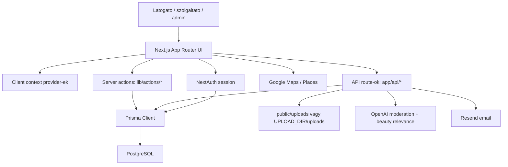
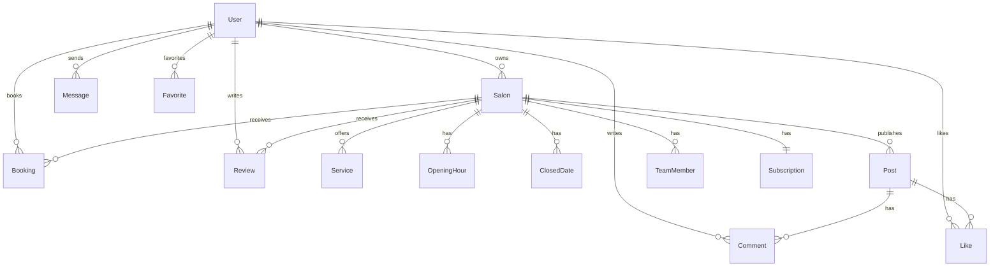

# GlowySpot projektterkep es AI elemzesi kontextus

Generalt: 2026-05-07  
Cel: ez a dokumentum egy masik AI-nak vagy elemzo agentnek adhato at, hogy gyorsan megertse a GlowySpot mukodesi strukturajat, termeklogikajat, technikai hatarait es a fejlesztesi/otletelesi lehetosegeket.

## 1. Roviden

GlowySpot egy Next.js App Router alapu szepsegipari piacter es social feed alkalmazas. A termek ket vilagot kot ossze:

- latogatok/ugyfelek szalonokat es szolgaltatokat bongesznek, kedvelnek, uzennek, ertekelnek;
- szolgaltatok szalonprofilt, kepeket, szolgaltatasokat, nyitvatartast, csapatot es bejegyzeseket kezelnek;
- admin felulet kezeli a felhasznalokat, kategoriakat, szolgaltatoi allapotokat es elofizetesi beallitasokat.

Technologiai alap:

- Next.js 16.1.4, App Router
- React 19.2
- TypeScript strict mod
- Prisma 6.19 + PostgreSQL, `@prisma/adapter-pg`
- NextAuth v4, Credentials + Google provider
- Tailwind CSS 4 + sajat UI komponensek/Radix
- Google Maps/Places
- Resend email kuldes
- OpenAI moderacio a kepfeltoltesnel
- Sharp kepkonverzio WebP-re

## 2. AI-nak szolo hasznalati utmutato

Ha ezt a dokumentumot egy AI kapja meg, a kovetkezo szempontok szerint erdemes vele dolgozni:

1. Termekstrategia: a GlowySpot jelenleg egyszerre marketplace, provider CRM es social feed. Az otletelesnel eloszor dontsd el, melyik irany az elsodleges.
2. Architektura: a server action reteg jelenleg tul sok domainlogikat tartalmaz egy fajlban, kulonosen `lib/actions/salon.ts`.
3. UX: a felhasznaloi szerepkorok jol elkulonulnek, de a feluletek kozott van atfedes es duplikacio.
4. Monetizacio: az elofizetesi modell adatmodellje jelen van, de a Stripe checkout/webhook nincs keszen.
5. Stabilitas: lint, TypeScript es build legutobb sikeres volt, de nincs lathato dedikalt unit/e2e teszt setup.
6. Kovetkezo jo elemzesi lepes: bontsd a rendszert domain modulokra, majd javasolj egyszerusitett roadmapet.

Javasolt AI prompt:

```text
Az alabbi dokumentum a GlowySpot Next.js projekt teljes kontextusterkepe. Elemezd termek-, architektura-, UX- es uzleti nezopontbol. Keszits priorizalt fejlesztesi javaslatokat ugy, hogy kozben megorzod a jelenlegi mukodo funkciokat. Kulon jelold: gyors nyereseg, strukturavaltoztatas, kockazatos refaktor, monetizacios otlet.
```

## 3. Magas szintu architektura



Fobb retegzes:

- `app/`: route-ok, oldalak, API route-ok, globalis layout.
- `components/`: UI komponensek domain szerint csoportositva.
- `lib/`: server actions, context-ek, auth, DB, subscription, email, utility.
- `prisma/`: adatmodell es seed.
- `scripts/`: migracios, adatkarbantarto es teszt segedscriptek.
- `docs/`: tervek, specifikaciok, audit eredmenyek.
- `.agent/`, `.superpowers/`: agent workflow-k, skillek, tervek. Ezek nem runtime app kodok.

## 4. Fontos gyokerfajlok

| Fajl | Szerep |
| --- | --- |
| `package.json` | NPM scriptek es fuggosegek. Csak `dev`, `build`, `start`, `lint` van definialva. |
| `next.config.ts` | Next kep remote pattern: Unsplash es ui-avatars. Standalone output kommentelve. |
| `tsconfig.json` | Strict TypeScript, App Router, `@/*` alias. |
| `eslint.config.mjs` | Next core web vitals + TypeScript lint config. |
| `prisma.config.ts` | Prisma schema es migration/seed konfiguracio. |
| `proxy.ts` | Next 16 proxy/middleware szerep: dashboard es salon route-ok vedelme. |
| `.env.production.example` | Fobb env mintak: DB, NextAuth, Google Maps/Auth, OpenAI, Resend, upload dir. |
| `README.md` | Meg alap create-next-app README, termekspecifikus dokumentacio hianyzik. |

## 5. Route terkep

### Publikus oldalak

| Route | Fajl | Funkcio |
| --- | --- | --- |
| `/` | `app/page.tsx` | Social feed, kiemelt szalonok, filter context, poszt kartyak. |
| `/providers` | `app/providers/page.tsx` | Szolgaltato/szalon bongeszo es kereso. |
| `/profile/[slug]` | `app/profile/[slug]/page.tsx` | Publikus szalon profil, posztok, galeria, review, kapcsolat. |
| `/profile/me` | `app/profile/me/page.tsx` | Bejelentkezett user sajat profil/atiranyitas jellegu oldal. |
| `/auth/reset-password` | `app/auth/reset-password/page.tsx` | Jelszo visszaallitas. |

### Dashboard es szerepkoros oldalak

| Route | Funkcio |
| --- | --- |
| `/dashboard` | szerepkor alapjan visitor/provider/admin dashboard |
| `/dashboard/favorites` | kedvenc szalonok |
| `/dashboard/messages` | uzenetek, thread-szeru UI |
| `/dashboard/salons` | user szalonjai |
| `/dashboard/subscription` | elofizetesi UI, jelenleg Stripe TODO-val |
| `/dashboard/comments` | komment/aktivitas dashboard jellegu oldal |
| `/dashboard/admin/overview` | admin osszefoglalo |
| `/dashboard/admin/providers` | admin szolgaltato kezeles |
| `/dashboard/admin/settings` | admin beallitasok, kategoriak/subscription config |
| `/dashboard/admin/visitors` | latogatok/felhasznalok kezelese |

### Szalon tulajdonosi oldalak

| Route | Funkcio |
| --- | --- |
| `/salon/[id]` | szalon menedzsment kezdooldal |
| `/salon/[id]/settings` | alapadatok, megjelenites, kontakt beallitasok |
| `/salon/[id]/services` | szolgaltatasok CRUD |
| `/salon/[id]/hours` | nyitvatartas es zarva tartas |
| `/salon/[id]/gallery` | galeria feltoltes/torles |
| `/salon/[id]/posts` | posztok kezelese |
| `/salon/[id]/team` | csapattagok kezelese |
| `/salon/[id]/contact` | kapcsolat/ertesitesi preferenciak |

### API route-ok

| Route | Fajl | Funkcio |
| --- | --- | --- |
| `/api/auth/[...nextauth]` | `app/api/auth/[...nextauth]/route.ts` | NextAuth Credentials + Google, JWT session. |
| `/api/upload` | `app/api/upload/route.ts` | Autholt kepfeltoltes, OpenAI moderacio, WebP konverzio, fajlmentes. |
| `/api/files/[filename]` | `app/api/files/[filename]/route.ts` | Lokalis feltoltott fajlok kiszolgalasa. |
| `/api/cron/expire-free-salons` | cron endpoint | Lejart FREE szalonok inaktivalasa. |
| `/api/cron/subscription-reminders` | cron endpoint | Lejarat elotti email emlekeztetok. |

## 6. Adatmodell osszefoglalo

Prisma schema: `prisma/schema.prisma`.

### Fobb entitasok

- `User`: NextAuth user + app szerepkor (`visitor`, `provider`, `admin`), inaktivalasi allapot.
- `Salon`: kozponti domain objektum. Tartalmaz cimet, kategoriakat, profil/cover/galeria kepeket, tulajdonost, szolgaltatasokat, nyitvatartast, posztokat, foglalasokat, review-kat, csapatot, uzeneteket es megjelenitesi preferenciakat.
- `Subscription`: FREE/STANDARD/PREMIUM csomag, statusz, Stripe azonosito mezok, free trial, post counter.
- `SubscriptionConfig`: admin altal allithato limitek es Stripe kulcs/price ID mezok.
- `Service`: szalon szolgaltatas, ar es idotartam jelenleg string tipusu.
- `Post`: social feed bejegyzes, kepek, videok, layout, like/comment.
- `Booking`: foglalas skeleton/domain alap.
- `Review`: ertekeles.
- `Message`: user-user/szalonhoz kotheto uzenet.
- `Comment`, `Like`, `Favorite`: social es marketplace interakciok.
- `Category`: admin altal kezelheto szolgaltatasi kategoria.
- NextAuth modellek: `Account`, `Session`, `VerificationToken`.
- `PasswordResetToken`: sajat jelszo reset flow.

### Kapcsolati modell



## 7. Fontos mukodesi folyamatok

### 7.1 Bejelentkezes es jogosultsag

- NextAuth route: `app/api/auth/[...nextauth]/route.ts`.
- Providers: Credentials + Google.
- Session strategy: JWT.
- Sessionbe bekerul: `user.id`, `user.role`, `user.name`.
- Inaktivalas utan 30 napon belul login vissza tudja aktivalni a usert, szalonjait es posztjait.
- Route vedelmet `proxy.ts` ad:
  - `/dashboard/*`: login kotelezo;
  - `/dashboard/admin/*`: admin role kotelezo;
  - `/salon/*`: provider vagy admin role kotelezo.

Megfigyeles:

- A proxy csak route-szintu vedelmet ad. A server actionok egy resze sajat `requireSession`/owner ellenorzest hasznal, ami jo. Ezt minden mutacios actionnel kovetkezetesen fenn kell tartani.
- A role stringkent van tarolva, nincs Prisma enum. Ez rugalmas, de konnyebben elgepeleshez vezethet.

### 7.2 Szalon letrehozas

Fobb UI-k:

- `components/wizard/SalonWizard.tsx`: reszletes, tobb lepeses onboarding.
- `components/salons/create-salon-modal.tsx`: egyszerubb modal.

Backend:

- `lib/actions/salon.ts` -> `createSalon`.
- Session user kotelezo.
- Tulajdonos idegen user nem lehet.
- Fingerprint duplicate check: telefon + cim normalizalva, SHA-256 hash.
- Letrehozas utan FREE subscription inicializalas.

Megfigyeles:

- A wizard nagyon nagy fajl (1000+ sor), sok felelosseggel: UI, validacio, Google Maps, file preview, upload flow, payload osszerakas.
- Ezt modulokra bontanam: `steps/*`, `useSalonWizardState`, `useSalonUploads`, `useAddressSelection`.

### 7.3 Feed es posztok

Fobb UI:

- `app/page.tsx`: kezdolapi feed.
- `components/home/feed-card.tsx`: poszt kartya.
- `components/home/post-detail-modal.tsx`: poszt reszletek, kommentek, like, lightbox.
- `components/salon/modals/PostModal.tsx`: poszt letrehozas/szerkesztes.

Backend:

- `getRecentPosts`: lapozott poszt lista, opcionseg szerint lokacio/kategoria filter.
- `createPost`: owner check + subscription post limit check.
- `updatePost`, `deletePost`: owner check.
- `toggleLike`, `addComment`, `getPostComments`.

Megfigyeles:

- A feed server actionben van console log: `Fetched ${posts.length} posts successfully`. Ez fejlesztesnel ok, productionben jobb lenne strukturalt dev-only logger.
- A kepekhez frissen bekerult hibaturo logika es lokalis fajl letezes ellenorzes javitja a torott kep rekordokat.
- A social funkciok termekileg erosek, de erdemes eldonteni: feed-first app vagy booking/provider-first app legyen-e a navigacio.

### 7.4 Kepfeltoltes

API:

- `POST /api/upload`.
- Auth kotelezo.
- OpenAI moderation: `omni-moderation-latest`.
- Beauty relevance: `gpt-4o-mini`, JSON valaszt var.
- Fail-open, ha nincs OpenAI kulcs vagy AI ellenorzes hibat dob.
- Sharp WebP konverzio quality 80.
- Mentese:
  - local dev: `public/uploads`
  - env esetben: `${UPLOAD_DIR}/uploads`
- Visszaadott URL: `/api/files/{filename}`.

Fajlkiszolgalas:

- `GET /api/files/[filename]`.
- Filename sanitize.
- Cache-Control immutable.

Megfigyeles:

- A fail-open moderacio jo fejleszteshez, de production biztonsaghoz vitathato. Erdemes configgal eldonteni: `UPLOAD_MODERATION_MODE=fail-open|fail-closed`.
- A fajlnev sanitize eltavolit karaktereket. Ekezetes vagy nagyon hasonlo fajlneveknel collision/kulonbseg lehet, bar timestamp segit.
- A deployment modelben fontos, hogy az `UPLOAD_DIR` tartos volume legyen. Vercel/serverless kornyezetben a lokalis fajlrendszer nem tartos.

### 7.5 Elofizetes

Adatmodell kesz:

- `Subscription`, `SubscriptionConfig`, Stripe mezok.
- FREE trial default: 60 nap.
- FREE post limit: 5 poszt / 30 nap.
- STANDARD/PREMIUM korlatlan poszt; video Standard+.
- Premium featured listing a `getFeaturedSalons` logikaban.

Meglevo logika:

- `initSubscription`
- `canCreatePost`
- `incrementPostCount`
- `canUploadVideo`
- `canUseBooking`
- `isPremium`
- `expireFreeSalons`

Hiany:

- Stripe checkout session route nincs kesz.
- Stripe webhook sync nincs kesz.
- Billing portal nincs kesz.
- Dashboard subscription page TODO-t es alertet hasznal.

Javaslat:

1. Elofizetesi domain kulon fajlba: `lib/billing/*`.
2. Stripe kulcsokat ne adatbazisban tarolt titkos mezokbol hasznaljuk elsokent, hanem env-alapu production setupbol. Admin UI-ba max price ID-k es publikus beallitasok keruljenek.
3. Webhook nelkul ne tekintsuk kesznek a fizetos csomagot.

### 7.6 Uzenetek es ertesites

- `sendMessage`, `getUserMessages`, `markMessageAsRead`, `getUnreadMessageCount`.
- `NotificationProvider` 30 masodpercenkent pollingol.
- Dashboard messages oldal thread UI-t epit.

Megfigyeles:

- Polling egyszeru es mukodik, de kesobb erdemes lehet SSE/WebSocket vagy legalabb focus/reconnect-alapu frissites.
- Uzeneteknel jo lenne explicit thread modell vagy conversation grouping, ha no a komplexitas.

### 7.7 Admin

Komponensek:

- `components/admin/UserManager.tsx`
- `components/admin/CategoryManager.tsx`
- `components/admin/CategoryModal.tsx`
- admin dashboard komponensek.

Actions:

- `lib/actions/user.ts`
- `lib/actions/category.ts`

Megfigyeles:

- Admin mutacioknal kulonosen fontos, hogy minden server action ellenorizze az admin szerepkort, ne csak a proxy vedjen. Ezt erdemes celzottan atvizsgalni.

## 8. Komponensstruktura

### `components/home`

Feed es marketplace nyito felulet:

- `feed-card.tsx`: social kartyak.
- `post-detail-modal.tsx`: komment/like/reszlet modal.
- `post-card.tsx`: alternativ/korabbi poszt kartya.
- `provider-card.tsx`: szalon/provider kartya.
- `story-bar.tsx`: kiemelt szalonok vizualis sor.
- `filter-bar.tsx`, `feed-toggle.tsx`, `hero-banner.tsx`.

### `components/layout`

Alkalmazas vaz:

- `main-layout.tsx`
- `navbar.tsx`, `top-bar.tsx`, `sidebar.tsx`, `right-sidebar.tsx`, `bottom-nav.tsx`
- `filter-panel.tsx`, `filter-modal.tsx`
- `active-salon-indicator.tsx`

Megfigyeles:

- Sok layout elem kliensoldali contextre epul. Ha teljesitmeny javitas a cel, erdemes a globalis client provider-eket szukebb scope-ba tenni.

### `components/salon`

Tulajdonosi szalonkezeles:

- Cards: `BasicInfoCard`, `ServicesCard`, `HoursCard`, `ClosedDatesCard`, `PostsCard`, `ContactSettingsCard`.
- Modals: service, post, hours, closed date, settings.
- `FavoriteButton`, `message-modal`.

### `components/profile`

Publikus profil UI:

- `profile-header`, `profile-hero`, `profile-sidebar`, `profile-tabs`, `ReviewModal`.

### `components/dashboard`

Szerepkoros dashboard:

- admin/provider/visitor dashboard komponensek.
- KPI, command header, timeline, portfolio widget, subscription badge.

### `components/ui`

Sajat design system + shadcn/Radix jellegu alapok:

- button, card, dialog, input, select, slider, switch, textarea, badge, avatar, etc.
- Google Maps address komponensek.
- `safe-image.tsx`: hibaturo Next Image wrapper.

Megfigyeles:

- Jo lenne dokumentalni a design tokeneket es a komponenshasznalatot, mert jelenleg a UI irany tobb korszakbol jon: warm peach/redesign/dark mode tervek + aktualis dark UI.

## 9. Context provider-ek

Globalis provider sorrend `app/layout.tsx` alatt:

1. `ThemeProvider`
2. `AuthProvider`
3. `GoogleMapsProvider`
4. `FilterProvider`
5. `SalonProfileProvider`
6. `NotificationProvider`
7. `Toaster`

Funkciok:

- `AuthProvider`: NextAuth sessionbol `userData`.
- `FilterProvider`: lokacio, radius, szolgaltatas filterek, keresoszo.
- `SalonProfileProvider`: aktiv szalon profil adatok.
- `NotificationProvider`: unread message count polling.
- `ThemeProvider`: light/dark/system, localStorage + inline FOIT script.
- `GoogleMapsProvider`: Maps script betoltes.

Megfigyeles:

- Minden oldal globalisan kap Google Maps Providert, akkor is, ha nincs map. Ez bundle/performance szempontbol javithato.
- A filter state memoriaban van; URL-ben nincs szinkron. Megoszthato keresesi linkekhez URL search params kellene.

## 10. Biztonsagi es strukturalt megfigyelesek

### Pozitivumok

- Strict TypeScript be van kapcsolva.
- NextAuth session es Prisma adapter hasznalatban van.
- Mutacios salon actionoknal sok helyen van owner check.
- Upload endpoint autholt.
- Filename sanitize van.
- Cron endpointok CRON_SECRET-tel vedhetok.
- Account inactivation/restore logika letezik.
- Kepmoderacio es beauty relevance check termekileg jo irany.

### Kockazatok / javitando pontok

1. **Admin authorization a server actionokban**  
   A proxy route vedelme nem eleg onmagaban. Minden admin action elejen explicit admin check kell.

2. **Tul nagy domain fajlok**  
   `lib/actions/salon.ts` kb. 900+ sor es nagyon sok felelosseget visz. Bontas:
   - `salon-crud.ts`
   - `salon-public-query.ts`
   - `post-actions.ts`
   - `message-actions.ts`
   - `booking-actions.ts`
   - `review-actions.ts`
   - `favorites-actions.ts`

3. **Nagy kliens komponensek**  
   `SalonWizard.tsx`, `post-detail-modal.tsx`, `UserManager.tsx`, `enhanced-address-picker.tsx` nagy es nehezen tesztelheto. Erdemes hookokra es kisebb step komponensekre bontani.

4. **Stripe csak felig van modellezve**  
   Az adatmodell kesz, de nincs checkout/webhook. A subscription UX jelenleg nem lehet teljesen mukodo.

5. **Nincs lathato teszt runner**  
   `package.json` nem tartalmaz `test`, `e2e`, `typecheck` scriptet. Fejlesztesi minoseghez ajanlott:
   - `typecheck`: `tsc --noEmit`
   - `test`: Vitest unit tesztek
   - `e2e`: Playwright smoke flow

6. **Encoding/karakter problema nyomai**  
   Tobb fajlban lathato mojibake jellegu magyar szoveg (`Szolgáltató`). Ez UX-ben es SEO-ban is rossz lehet. Erdemes UTF-8 auditot futtatni.

7. **Public/upload asset strategia**  
   A lokalis feltoltes jo devben, de productionben tartos storage kell. Javasolt S3/R2/Supabase Storage vagy mas object storage.

8. **README nem termekspecifikus**  
   A gyoker README meg create-next-app sablon. Onboardinghoz kritikus lenne a valodi setup dokumentacio.

9. **Archive/artifact zaj a gyokerben**  
   Sok `.tar`, `.tar.gz`, `deployment.tar.gz`, `eslint-report.json`, `models.json` van a repo gyokereben. Ezeket erdemes archivalni vagy `.gitignore`/release artifact kezeles ala tenni.

10. **Global provider es client-heavy app**  
    Next.js best practice szerint a `use client` hatarokat szukiteni kellene. Jelenleg sok oldal kliensoldali adatbetoltesre es contextre epul.

## 11. Fejlesztesi javaslatok prioritas szerint

### Gyors nyeresegek

- Termekspecifikus README irasa: setup, env, DB, seed, dev server, deploy.
- `package.json` scriptek bovitese:
  - `typecheck`
  - `test`
  - `smoke`
  - `prisma:generate`
  - `prisma:migrate`
- Mojibake/UTF-8 szovegek javitasa.
- `console.log` production kockazatok tisztitasa vagy logger helper.
- Next Image `sizes` warningok vegleges rendezese minden fill kepnel.
- Gyokerben levo archive fajlok rendezese.

### Kozepes refaktorok

- `lib/actions/salon.ts` domain modulokra bontasa.
- `SalonWizard.tsx` kisebb komponensekre es hookokra bontasa.
- Admin server actionok explicit role guardja.
- Filter state URL search param alapuva tetele.
- Upload storage absztrakcio: local adapter + production object storage adapter.
- `Service.price` es `duration` tipus ujragondolasa. Ar lehet Decimal/Int minor unit, duration lehet perc Int.

### Nagyobb termek/architekturavaltoztatasok

- Stripe checkout + webhook + billing portal teljes implementacio.
- Booking flow valodi vezerlese: idopont slotok, availability, status transition.
- Messaging conversation modell.
- Search/indexing: lokacio + kategoria + text search normalizaltan.
- SEO: publikus szalon profilok metadata, structured data, sitemap.
- Observability: structured logs, upload/error metrics, cron report.

## 12. Javasolt modulhatarok

Idealizalt jovobeli szerkezet:

```text
lib/
  auth/
    require-session.ts
    require-role.ts
  db/
    prisma.ts
  salon/
    queries.ts
    mutations.ts
    ownership.ts
    image-policy.ts
  posts/
    queries.ts
    mutations.ts
    limits.ts
  billing/
    config.ts
    plans.ts
    stripe.ts
    webhooks.ts
  messaging/
    queries.ts
    mutations.ts
  uploads/
    local-storage.ts
    object-storage.ts
    moderation.ts
  admin/
    users.ts
    categories.ts
```

Cel: a domain szabalyok ne keveredjenek a UI-val, es a server action fajlok ne legyenek orias "mindenes" modulok.

## 13. Funkcionalis terkep szerepkor szerint

### Visitor

- szalonok bongeszese;
- feed olvasasa;
- regisztracio/login;
- kedvencek;
- uzenetkuldes;
- komment/like bejelentkezve;
- profil/adatok kezelese.

### Provider

- szalon letrehozasa;
- szalon adatok szerkesztese;
- szolgaltatasok kezelese;
- nyitvatartas/zarva tartas;
- galeria es posztok;
- uzenetek;
- elofizetes oldal;
- csapat/profil tortenet.

### Admin

- felhasznalok kezelese;
- szolgaltatok attekintese;
- kategoriak kezelese;
- admin dashboard;
- subscription config mezok.

## 14. Kulso szolgaltatasok

| Szolgaltatas | Mire hasznalja |
| --- | --- |
| PostgreSQL | Fo adatbazis |
| NextAuth | Auth/session |
| Google OAuth | Social login |
| Google Maps/Places | Cimkereses, terkep, koordinata |
| OpenAI | Kepmoderacio es beauty relevance |
| Resend | Email kuldes |
| Stripe | Modellben elokeszitve, meg nem teljes integracio |
| Unsplash/ui-avatars | Default/fallback kepek |

## 15. Deployment/ops jegyzetek

- Dockerfile es docker-compose fajlok vannak.
- `.env.production.example` Dockeres Postgres hostot feltetelez: `glowyspot-db`.
- `UPLOAD_DIR=/app/public` jelzi, hogy kontenerben lokalis public volume lehet tervben.
- Cron endpointokat kulso cron hivhatja.
- Next standalone output kommentelve; ha VPS/Docker deployment a cel, ezt ujra at kell gondolni.

Kockazat:

- Ha az app serverless kornyezetben fut, a lokalis upload storage nem tartos.
- Ha nincs `CRON_SECRET`, a cron endpoint vedelmi logikaja jelenleg engedekenyebb: csak akkor ellenoriz, ha env-ben van secret. Productionben legyen kotelezo.

## 16. Aktualis minosegi allapot

Legutobbi ismert ellenorzesek a korabbi javitasok utan:

- ESLint: atment.
- TypeScript `tsc --noEmit`: atment.
- Next build: atment.
- Browser smoke: a kezdolapon nem volt framework overlay, a korabbi torott kep referenciak kiszurese megtortent.

Megmaradt minosegi hiany:

- Nincs dedikalt `test` script.
- Nincs e2e smoke teszt a repo standard scriptjei kozott.
- UX/SEO audit scriptek korabban regi HTML/design artifactokat is jeloltek.

## 17. Saját meglátások

Termek szempontbol a GlowySpotban sok potencial van, mert nem csak listaoldal: van feed, profil, szolgaltatas, uzenet, elofizetes, admin. Pont ez az ereje es a kockazata is. A kovetkezo nagy dontes szerintem az, hogy a termek "Instagram-szeru szepseg feed" vagy "szalonkereso/foglalasi marketplace" legyen-e elsodlegesen. Mindketto mukodhet, de a navigacio, onboarding es monetizacio mas hangsulyt igenyel.

Technikailag a projekt jobb allapotban van, mint egy tipikus prototipus: van strict TS, Prisma schema, auth, role routing, upload pipeline. A legfontosabb kovetkezo lepes nem uj feature, hanem a domain modulok tisztabb szetvalasztasa es egy minimalis teszt/QA alap letrehozasa.

Ha en vezetnem a kovetkezo fejlesztesi kort, ezt a sorrendet valasztanam:

1. Dokumentalt setup + scriptek + minimalis smoke tesztek.
2. Admin/server action authorization audit.
3. `salon.ts` es `SalonWizard.tsx` bontasa.
4. Upload storage strategia productionre.
5. Stripe teljes billing flow.
6. Booking flow valodi termekesitese.
7. SEO es publikus profil optimalizalas.

## 18. Kovetkezo AI elemzesi feladatok

Ezeket kulon promptokban erdemes futtatni:

1. "Tervezz uj modulstrukturat a `lib/actions/salon.ts` szetszedesere ugy, hogy a publikus API ne torjon."
2. "Elemezd a GlowySpot UX-et marketplace vs social feed pozicionalas szerint."
3. "Keszits Stripe integracios tervet a meglevo Subscription modellre."
4. "Keszits Playwright smoke teszt tervet a legfontosabb 8 flow-ra."
5. "Keszits SEO es structured data tervet szalon profil oldalakhoz."
6. "Keszits production deployment tervet Docker + tartos upload storage + cron endpointok alapjan."
